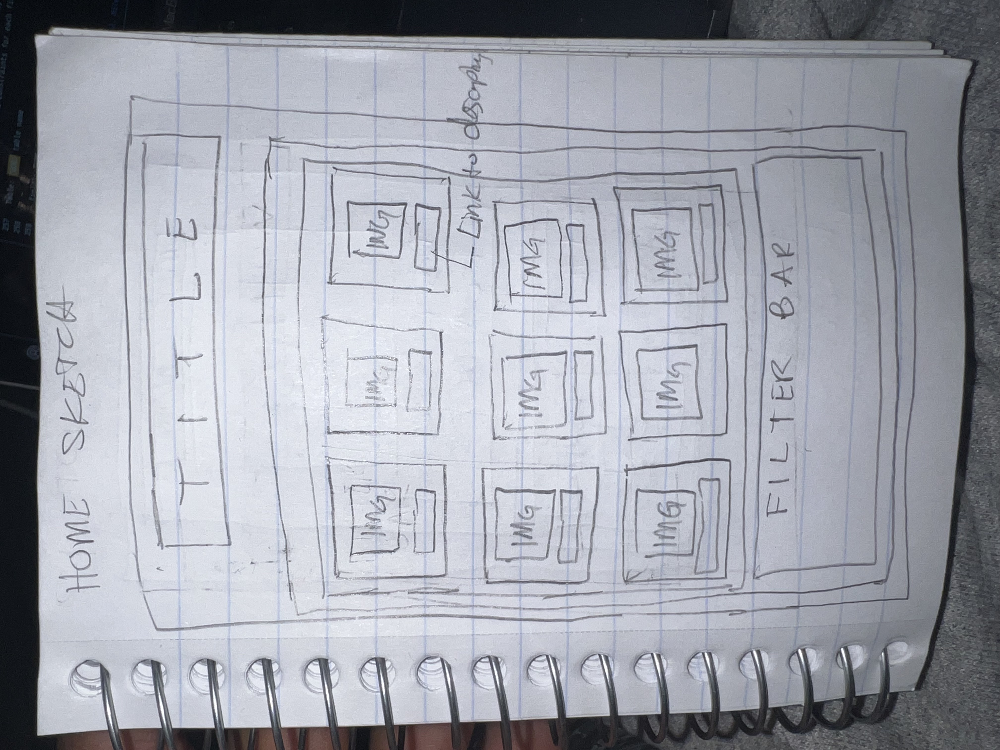
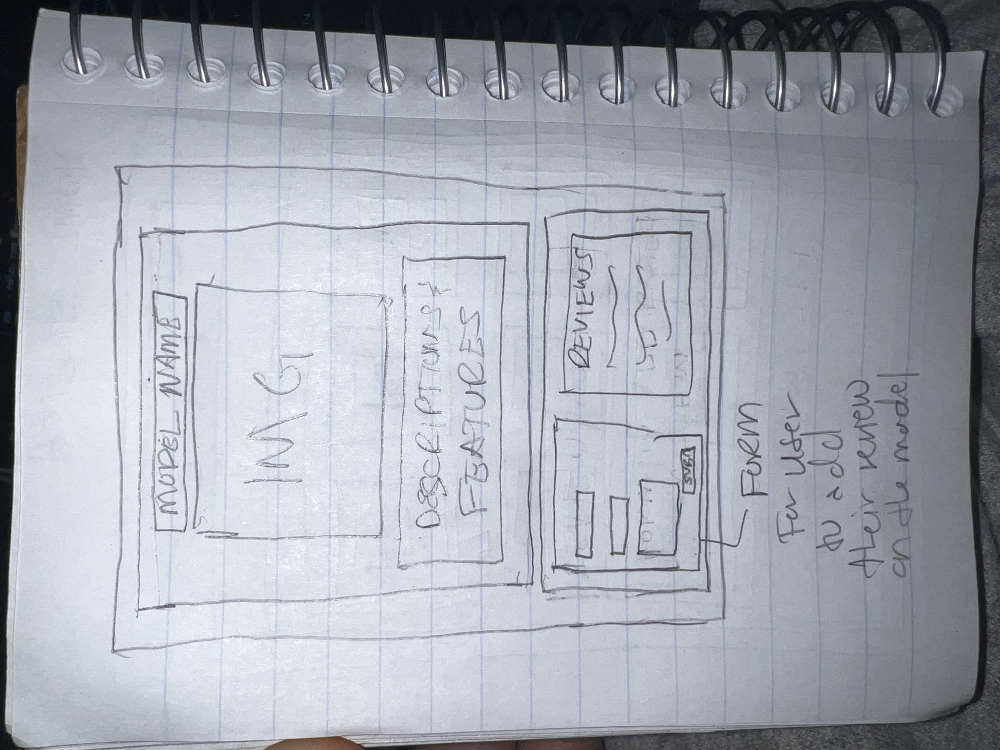

# Project 3: Design Journey

**For each milestone, complete only the sections that are labeled with that milestone.** Refine all sections before the final submission.

You are graded on your design process. If you later need to update your plan, **do not delete the original plan, rather leave it in place and append your new plan _below_ the original.** Then explain why you are changing your plan. Any time you update your plan, you're documenting your design process!

**Replace ALL _TODOs_ with your work.** (There should be no TODOs in the final submission.)

Be clear and concise in your writing. Bullets points are encouraged.

**Everything, including images, must be visible in _Markdown: Open Preview_.** If it's not visible in the Markdown preview, then we can't grade it. We also can't give you partial credit either. **Please make sure your design journey should is easy to read for the grader;** in Markdown preview the question _and_ answer should have a blank line between them.


## Design Plan (Milestone 1)

**Make the case for your decisions using concepts from class, as well as other design principles, theories, examples, and cases from outside of class (includes the design prerequisite for this course).**

You can use bullet points and lists, or full paragraphs, or a combo, whichever is appropriate. The writing should be solid draft quality.


### Catalog (Milestone 1)
> What will your catalog website be about? (1 sentence)

 catalog topic: My catalog website will be a guitar catalog where players can sell and buy guitars.


### _Consumer_ Audience (Milestone 1)
> Briefly explain your site's _consumer_ audience. Your audience should be specific, but not arbitrarily specific. (1 sentence)
> Justify why this audience is a **cohesive** group. (1-2 sentences)

 site audience:

  My site audience is guitar players and general instrument lovers.

 why is this a _cohesive_ audience?

 This audience is cohesive because it targets the individuals who play and love guitar but can also target to the more broader music-loving audience.


### _Consumer_ Audience Goals (Milestone 1)
> Document your _consumer_ audience's goals for using this catalog website.
> List each goal below. There is no specific number of goals required for this, but you need enough to do the job (Hint: It's more than 1. But probably not more than 3.)
> **Hint:** Users will be able to view all entries in the catalog and insert new entries into the catalog. The audience's goals should probably relate to these activities.

Goal 1: To buy/search/sell a new/used guitar

- **Design Ideas and Choices** _How will you meet those goals in your design?_
  - Include pictures and valid descriptions of each item.
  - Align the images and descriptions neatly.
  - Allow for users to search for a guitar type
- **Rationale & Additional Notes** _Justify your decisions; additional notes._
  - Including pictures and descriptions give the user a good idea of what they are looking for.
  - Aligning the images and descriptions make the website more usable and more easy to use.
  - Including a search tool gives the user more specific accessibility to items in the catalog

Goal 2: Find a community of guitar players

- **Design Ideas and Choices** _How will you meet those goals in your design?_
  - Include Usernames, as well as guitar reviews for every guitar model on the site.
- **Rationale & Additional Notes** _Justify your decisions; additional notes._
  - By adding usernames, comments/reviews it shows the user that their is someone who shares their interest and not just a random company telling them something.

Goal 3: Learn more about specific guitar models

- Incorporate useful and concise knowledge on each guitar model displayed on the catalog
  - Rationale: this gives th user a clear description of what they are looking to potentially buy
- Highlight/Bolden the important specs and features of each guitar model
  - Rationale: Clearly indicating the most important features of the model allows the user to have all the information needed to make a purchase decision.


 add as many goals as needed


### _Consumer_ Audience Device (Milestone 1)
> How will your _consumer_ audience access this website? From a narrow (phone) or wide (laptop) device?
> Justify your decision. (1 sentence)

 audience device:

- My audience will preferably access the website via laptop however if I am able to I will add media queries to have it usable on a mobile device

 audience device justification:

- A laptop website will allow for the most information to be put on the screen and overall benefits the user.


### _Consumer_ Persona (Milestone 1)
> Use the goals you identified above to develop a persona of your site's _consumer_ audience.
> Your persona must have a name and a face. The face can be a photo of a face or a drawing, etc.

persona's face:

.jpeg)

persona name:

David (40)

**Factors that Influence Behavior:**

summary of the persona's factors that influence their behavior (1-2 bullet points)

- An intermediate guitar player and has been playing for almost 5 years.
- Works at a law firm on the weekdays but uses hiw weekends to play guitar with his friends
- Wants to find a larger community of guitar players

**Goals:**

summary of persona's goals (1-2 bullet points)

- Wants to start a collection of Les Paul Gibson guitars
- Wants to connect with other guitar players locally/worldwide
- Wants to purchase a new guitar very soon

**Obstacles:**

summary of persona's obstacles (1-2 bullet points)

- Isn't very tech savvy and has trouble navigating websites
- Usually looks for equipment on the weekdays and doesn't have as much time to search
- Is on the go frequently and would like a shipping option.

**Desires:**

summary of persona's desires (1-2 bullet points)

- Wants a specific model of guitar to continue his collection
- Desires a quick and convenient process of searching and finding a guitar.

### _Administrator_ Audience (Milestone 1)
> Briefly explain your site's _administrator_ audience. Your audience should be specific, but not arbitrarily specific. (1 sentence)
> Justify why this audience is a **cohesive** group. (1-2 sentences)

site audience:

- Individuals who are interested in Guitar

why is this a _cohesive_ audience?

This is a cohesive audience because individuals who are intereseted in guitar are the main users of catalog and are able to access and add their reviews and comments about the different guitar models.


### _Administrator_ Audience Goals (Milestone 1)
> Document your _administrator_ audience's goals for using this catalog website.
> List each goal below. There is no specific number of goals required for this, but you need enough to do the job (Hint: It's more than 1. But probably not more than 3.)
> **Hint:** Users will be able to view all entries in the catalog and insert new entries into the catalog. The audience's goals should probably relate to these activities.

Goal 1: Give reviews on existing models on the catalog

- **Design Ideas and Choices** _How will you meet those goals in your design?_
  - Incorporate a form that allows the user to add a review on a model
- **Rationale & Additional Notes** _Justify your decisions; additional notes._
  - This gives the user accessiblity to the catalog's database and gives more interactivity to the user

Goal 2: Filter through the guitar models for selection

- **Design Ideas and Choices** _How will you meet those goals in your design?_
  - Add a filter option using arrows and search tools to the catalog.
- **Rationale & Additional Notes** _Justify your decisions; additional notes._
  - Allowing the user to filter through the data will help make things more efficient for the user and increae convenience.

Goal 3: View all the entries available in the catalog

- Incorporate a show all option that shows the user all the options available in the catalog
  - Rationale: This is most likely the most efficient way for the user to see all the entries put in the catalog.


 add as many goals as needed


### _Administrator_ Persona (Milestone 1)
> Use the goals you identified above to develop a persona of your site's _administrator_ audience.
> Your persona must have a name and a face. The face can be a photo of a face or a drawing, etc.

persona's face:
.jpeg)

persona name:
Sarah

**Factors that Influence Behavior:**

 summary of the persona's factors that influence their behavior (1-2 bullet points)

- A 22 year old newer guitar player who just purchased her first guitar (Purple Fender Stratocaster). Enjoys learning and looking at guitars and would like to share her experience about how her first guitar plays for her.

**Goals:**

summary of persona's goals (1-2 bullet points)

- To share her experience with her first guitar
- Find a community of newer guitar players who are looking to find/play guitar

**Obstacles:**

summary of persona's obstacles (1-2 bullet points)

- Has a little anxiety of playing guitar/talking about it
- Has a lot of time but doesn't know where to look for a shared community

**Desires:**

summary of persona's desires (1-2 bullet points)

- Wants to get more comfortable with learning about guitars and finding out about the features of the guitar she has.
- Wants to potentially find her next purchase down the line and would like an accessible way to find models and sort by color/specs


### Catalog Data (Milestone 1)
> Using your personas, identify the data you need to include in the catalog for your site's audiences.
> Justify why this data aligns with your persona's goals. (1 sentence)

list the data your persona will need to effectively use the catalog

- model type
- year of model
- color
- price
- feature description
- reviews
- usernames


Justify why this data aids the persona with their goals.

- All the listed data gives the user all the necessary information and accessibility to add their own reviews and make purchase decisions for each item.


### Site Design (Milestone 1)
> Design your catalog website to address the goals of your personas.
> Sketch your site's design:
>
> - These are **design** sketches, not _planning_ sketches.
> - Use text in the sketches to help us understand your design.
> - Where the content of the text is unimportant, you may use squiggly lines for text.
> - **Do not label HTML elements or annotate CSS classes.** This is not a planning sketch.
>
> Provide a brief explanation _underneath_ each sketch. (1 sentence)
> **Refer to your persona by name in each explanation.**

sketch(es) + explanation:



Explanation: This sketch gives the user an outlook of all of the available model types that are available on the catalog.



Explanation: This sketch allows for the user to not only see the model in a clearer format but also add their own reviews via the form


### Catalog Design Patterns (Milestone 1)
> Explain how you used design patterns in your site's design. (1-2 sentences)

design pattern explanation

- The home sketch follows a pattern that includes the image of the guitar model with the a link that leads to the a larger picture of the model w/the review and descriptions.

## Implementation Plan (Milestone 1, Milestone 2, Milestone 3, Final Submission)

### Database Schema (Milestone 1)
> Plan the structure of your database. You may use words or a picture.
> A bulleted list is probably the simplest way to do this.
> Make sure you include constraints for each field.

Table: guitars

- id: INTEGER {PK, NN, U}
- model: TEXT {NN},
- year: TEXT {NN}
- color TEXT {NN}
- description TEXT {NN}
- reviews INTEGER {FK, NN, U}

Table: reviews

- id: INTEGER {PK, NN, U}
- username: TEXT {NN, U}
- review: TEXT {NN}


### Database Query Plan (Milestone 1, Milestone 2, Milestone 3, Final Submission)
> Plan _all_ of your database queries.
> You may use natural language, pseudocode, or SQL.

```
Plan a query:

SELECT * FROM guitars;
SELECT * FROM guitars WHERE model ORDER BY color;
```

```
Plan another query:
SELECT * FROM guitars ORDER BY year ASC;
```

SELECT * FROM reviews;


## Complete & Polished Website (Final Submission)

### Accessibility Audit (Final Submission)
> Tell us what issues you discovered during your accessibility audit.
> What do you do to improve the accessibility of your site?
audit fixes

I changed the contrast colors of the nav bars as well as the link colors for the each of the anchor tags for the guitar models. I also added form labels that were missing for the upload button.


### Self-Reflection (Final Submission)
> Reflect on what you learned during this assignment. How have you improved from Projects 1 and 2?

reflection

- I think I have learned a lot about server side web developing especially through SQL queries and JOIN queries. I believe I still have things to learn but am proud of what I was able to accomplish.


> Take some time here to reflect on how much you've learned since you started this class. It's often easy to ignore our own progress. Take a moment and think about your accomplishments in this class. Hopefully you'll recognize that you've accomplished a lot and that you should be very proud of those accomplishments! (1-3 sentences)

reflection:

Again, I've learned a lot about PHP language and how to use it to build server side websites, I think moving forward I still have more to learn but from the things I was able to retain I am proud of what I have done.


### Collaborators (Final Submission)
> List any persons you collaborated with on this project.

 list your collaborators:

 Me


### Reference Resources (Final Submission)
> Please cite any external resources you referenced in the creation of your project.
> (i.e. W3Schools, StackOverflow, Mozilla, etc.)

 list reference resources

 W3Schools, Mozilla, Lecture Notes


### Grading: User Accounts (Final Submission)
> The graders will need to log in to your website.
> Please provide the usernames and passwords.

**Administrator User:**

- Username: kyle
- Password: monkey

**Consumer User:**

- Username: sharon
- Password: monkey

**Note:** Not all websites will support consumer log in. If your website doesn't, say so.


### Grading: Step-by-Step Instructions (Final Submission)
> Write step-by-step instructions for the graders.
> The project if very hard to grade if we don't understand how your site works.
> For example, you must log in before you can delete.
> For each set of instructions, assume the grader is starting from /

_View all entries:_

1. Sign in using the username and all entries will show
2. Click the #6-string tag

_View all entries for a tag:_

1. Click on each tag to view all entries

_View a single entry's details:_

1. Click the link under the each model image.
2.

_How to insert and upload a new entry:_

1. Fill in the form below the browse button
2. Browse through files to upload images
3. Press upload button

_How to delete an entry:_

1. TODO: instructions
2.
